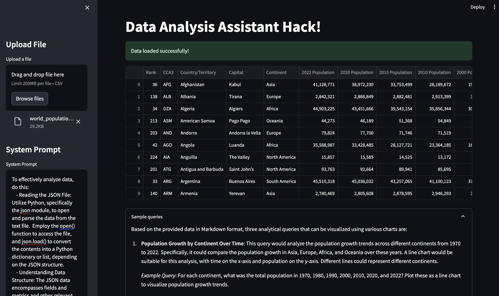

# AOAI-Analyst-GPT-Assistants-API

This is a sample project that show power of OpenAI Assistants API to reason oer structured data.

## Setup

```shell

pip install -r requirements.txt
```

## Run

```shell
streamlit run home.py
```

## Sample screen

